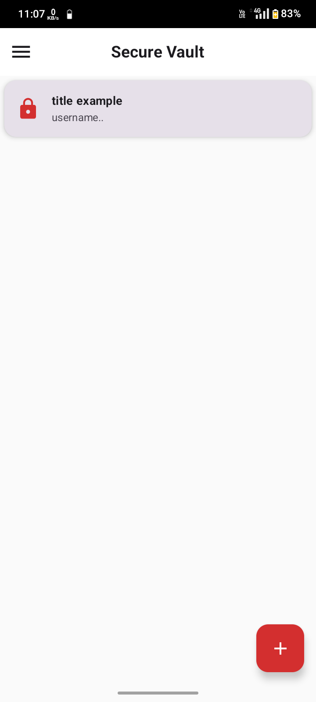
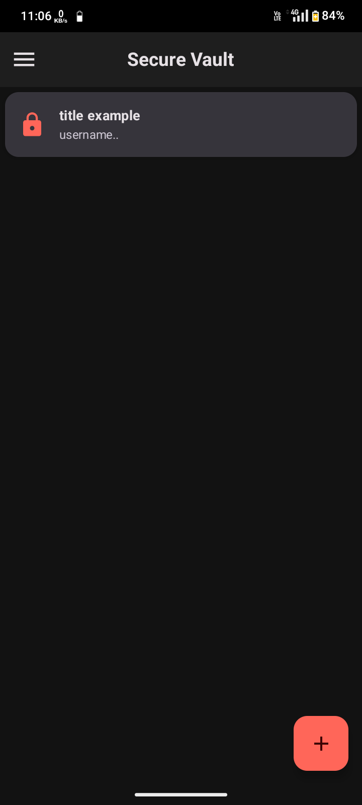
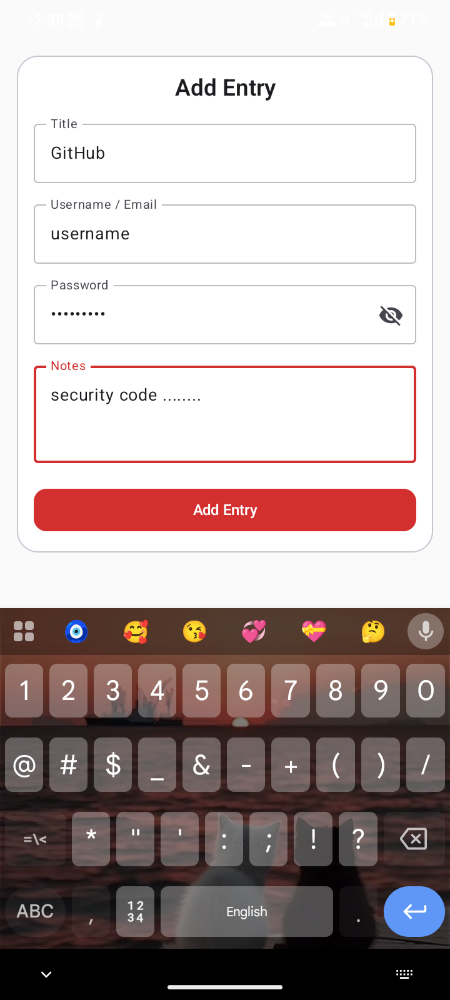
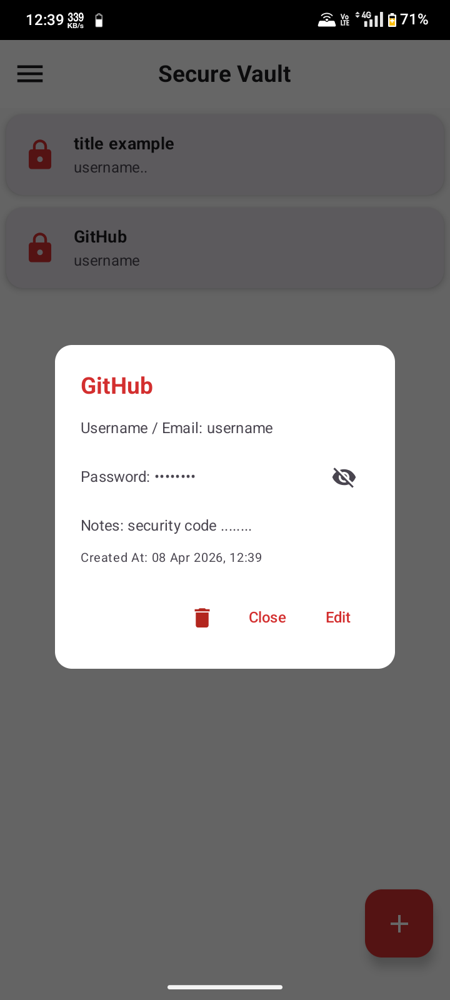
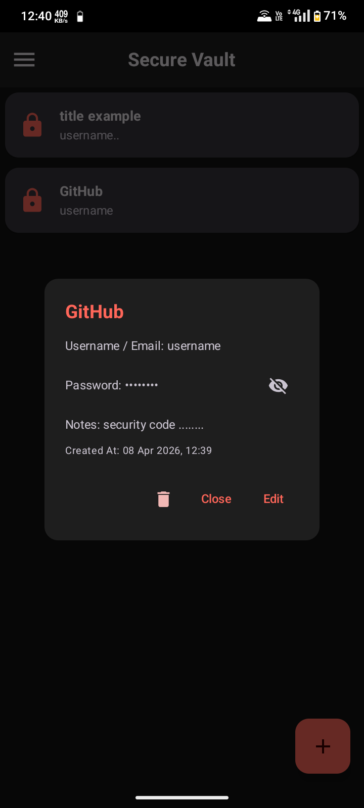
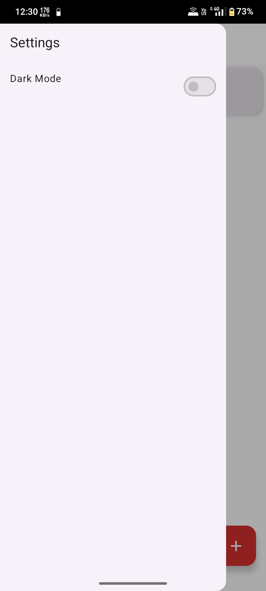
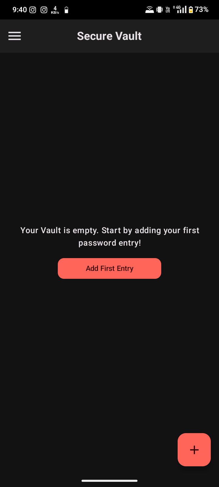
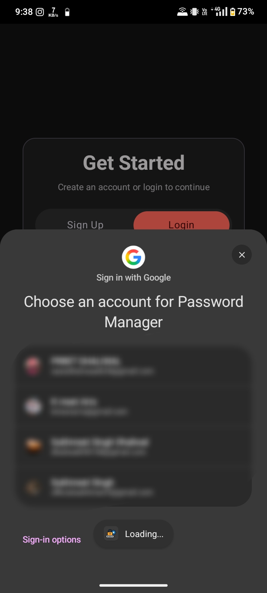
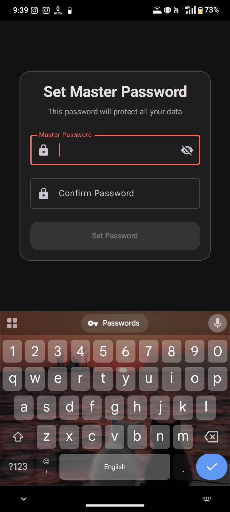
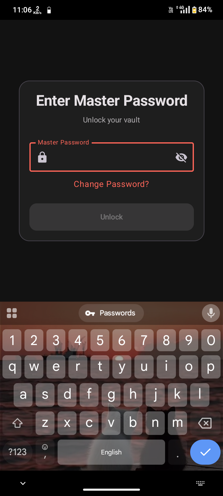

# 🔐 Secure Password Manager (Android)

A security-focused Android password manager implementing **client-side encryption**, **strong key derivation**, and **zero-knowledge storage principles**.

---

## 🚀 Key Highlights

- 🔐 **AES-256 GCM Encryption**
  - Ensures both confidentiality and integrity of data

- 🔑 **Secure Key Derivation**
  - PBKDF2WithHmacSHA256
  - 200,000+ iterations
  - Unique per-user salt

- 🧠 **Zero-Knowledge Design (Basic)**
  - Master password is never stored
  - Firebase only stores encrypted data

- 🗂 **Encrypted Vault**
  - Entire vault stored as encrypted JSON
  - Decryption happens locally on device

- 🔒 **Authentication via Cryptography**
  - Incorrect password → GCM authentication failure

- 📱 **Modern Android Stack**
  - Kotlin + Jetpack Compose + MVVM

---

## 🧱 Architecture

```text
User → Master Password
        ↓
   PBKDF2 (Key Derivation)
        ↓
   AES Key (256-bit)
        ↓
Decrypt / Encrypt Vault
        ↓
Firebase (Encrypted Vault + Salt)
```

---

## 🔐 Security Flow

1. User logs in (Firebase Authentication)  
2. App fetches **salt** from database  
3. User enters master password  
4. Key is derived using PBKDF2  
5. Vault is decrypted locally using AES-GCM  
6. If password is incorrect:
   - Decryption fails (authentication error)
   - Vault remains locked  

---

## 🛡 Threat Model

| Scenario | Protection |
|--------|-----------|
| Firebase data leak | Data is encrypted (AES-GCM) |
| Wrong password | Decryption fails |
| Server compromise | No plaintext data exposed |
| Password storage | Not stored anywhere |

---

## 📸 Screenshots

### 🗂 Vault (Light & Dark Mode)
<p align="center">
  
  
</p>

---

### ➕ Add Entry
<p align="center">
  
</p>

---

### 🔐 Vault Dialog
<p align="center">
  
  
</p>

---

### 🌙 Dark Mode Toggle
<p align="center">
  
</p>

---

### 📭 Empty State
<p align="center">
  
</p>

---

### 🔑 Authentication
<p align="center">
  
  
  
</p>

---

## 🎯 Status

✅ **Completed & Functional**

---

## 📦 Installation

```bash
git clone https://github.com/sukhmmeet/Password-Manager.git
```

1. Open in Android Studio  
2. Add your `google-services.json`  
3. Run the app 🚀  

---

## 🤝 Contributing

Contributions are welcome.  
Feel free to fork and submit pull requests for improvements.

---

## 📄 License

This project is open-source and free to use.

---
